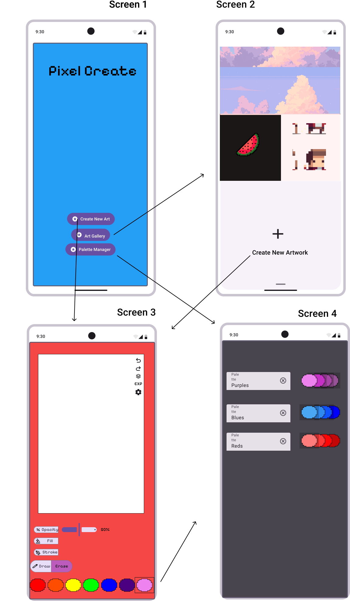



## Page contents
{:.no_toc:}

- ToC
{:toc}

## UML Class Diagram

[//]: # (TODO Use Markdown or Liquid include to show UML class diagram in SVG format, linking to PDF format. )

### WireFrame Diagram
