[](../pdf/updated-erd-diagram.pdf)

## Entity-Relationship Diagram

This ERD represents the database structure for the Pixel Create pixel art application, designed to support local persistence using Room Database with potential for cloud synchronization.

For detailed descriptions and source code links for all entity classes and DAO interfaces, see the [Entity Classes](entities.md) page.

## Entity Descriptions

### Core Entities

#### User
Stores user account information, authentication details, and personalized settings that persist across devices.

**Key Attributes:**
- `userId`: Primary key, unique identifier
- `username`, `email`: Account credentials
- `defaultCanvasWidth/Height`: User preference for new projects
- `themePreference`: Light/dark mode setting
- `gridVisibility`, `zoomSensitivity`: Tool preferences

**Relationships:**
- One user creates many projects (1:N)
- One user creates many custom palettes (1:N)

---

#### Project
The central entity representing a pixel art creation. Contains metadata about canvas size, timestamps, and thumbnail preview.

**Key Attributes:**
- `projectId`: Primary key
- `projectName`: User-defined name
- `canvasWidth/Height`: Pixel dimensions of the canvas
- `thumbnailImage`: Small preview for gallery display
- `isDeleted`: Soft-delete flag for recovery

**Relationships:**
- One project has many layers (1:N, mandatory - at least one layer)
- One project has many autosave snapshots (1:N)
- One project generates many export history records (1:N)

---

#### Layer
Represents individual drawing layers within a project, supporting complex artwork with stacking and visibility controls.

**Key Attributes:**
- `layerId`: Primary key
- `layerOrder`: Stacking position (Z-index)
- `isVisible`: Show/hide toggle
- `isLocked`: Prevent editing
- `opacity`: Transparency level (0.0 - 1.0)

**Relationships:**
- One layer contains many pixels (1:N)
- Multiple layers belong to one project (N:1)

---

#### Pixel
Stores individual pixel color data. Each pixel is tied to a specific layer and position.

**Key Attributes:**
- `pixelId`: Primary key
- `xCoordinate`, `yCoordinate`: Position on the canvas
- `colorValue`: ARGB or hex color value
- `lastModified`: Timestamp for tracking changes

**Relationships:**
- Many pixels belong to one layer (N:1)

**Design Note:**
For large canvases, storing each pixel individually may require optimization (e.g., sparse storage for transparent pixels, compression, or delta encoding).

---

### Color Management

#### Palette
User-created color collections for consistent artwork styling.

**Key Attributes:**
- `paletteId`: Primary key
- `paletteName`: User-defined name
- `isDefault`: Flag for system-provided palettes
- `lastUsed`: For sorting recently used palettes

**Relationships:**
- One palette contains many colors (1:N, mandatory - at least one color)
- One user creates many palettes (N:1)

---

#### PaletteColor
Individual colors within a palette.

**Key Attributes:**
- `colorId`: Primary key
- `colorValue`: ARGB or hex representation
- `colorOrder`: Display order within palette
- `colorName`: Optional user-defined label (e.g., "Sky Blue")

**Relationships:**
- Many colors belong to one palette (N:1)

---

### Data Persistence & History

#### AutosaveSnapshot
Periodic backups of project state to prevent data loss.

**Key Attributes:**
- `snapshotId`: Primary key
- `snapshotData`: Serialized project state (could be JSON or binary)
- `fileSize`: Storage tracking

**Relationships:**
- Many snapshots belong to one project (N:1)

**Design Note:**
Consider retention policy (e.g., keep last 10 snapshots, delete older than 30 days).

---

#### ExportHistory
Logs every export operation for tracking and re-export functionality.

**Key Attributes:**
- `exportId`: Primary key
- `fileName`: Generated or user-specified name
- `filePath`: Location in device storage
- `fileFormat`: PNG, JPG, etc.
- `resolution`, `scaleFactor`: Export dimensions

**Relationships:**
- Many exports belong to one project (N:1)

---

## Relationship Cardinalities

| Relationship | Cardinality | Description |
|-------------|-------------|-------------|
| User → Project | 1:N | One user creates many projects |
| User → Palette | 1:N | One user creates many palettes |
| Project → Layer | 1:N | One project has many layers (minimum 1) |
| Layer → Pixel | 1:N | One layer contains many pixels |
| Project → AutosaveSnapshot | 1:N | One project has many snapshots |
| Project → ExportHistory | 1:N | One project has many export records |
| Palette → PaletteColor | 1:N | One palette contains many colors (minimum 1) |

---

## Database Schema Location

The Room database schema is stored in:
```
app/schemas/edu.cnm.deepdive.myproject.service.LocalDatabase/1.json
```

DDL output location (configured in `build.gradle.kts`):
```
docs/sql/ddl.sql
```

---

## Design Considerations

### Normalization
The schema follows 3NF (Third Normal Form):
- No transitive dependencies
- Each entity has a single-column primary key
- Relationship tables (junction tables) would be added if many-to-many relationships are needed (e.g., shared palettes)

### Indexing Recommendations
- Index `projectId` in Layer, AutosaveSnapshot, ExportHistory
- Index `layerId` in Pixel
- Index `paletteId` in PaletteColor
- Composite index on `(xCoordinate, yCoordinate, layerId)` for pixel lookups
- Index `userId` in Project and Palette

### Performance Optimizations
- **Pixel Storage**: For large canvases, consider using sparse storage or run-length encoding to reduce storage for transparent/empty pixels
- **Autosave Strategy**: Implement differential snapshots rather than full project serialization
- **Thumbnail Generation**: Generate thumbnails asynchronously and cache in-memory
- **Lazy Loading**: Load pixel data only for visible layers in the viewport

### Future Extensions (Stretch Goals)
If animation features are added:
- **AnimationFrame** entity (linked to Project)
- **FramePixel** entity (linking frames to pixel data with timing information)

If collaboration features are added:
- **ProjectCollaborator** junction table (User-Project many-to-many)
- **VersionHistory** entity for tracking changes and merges

---


