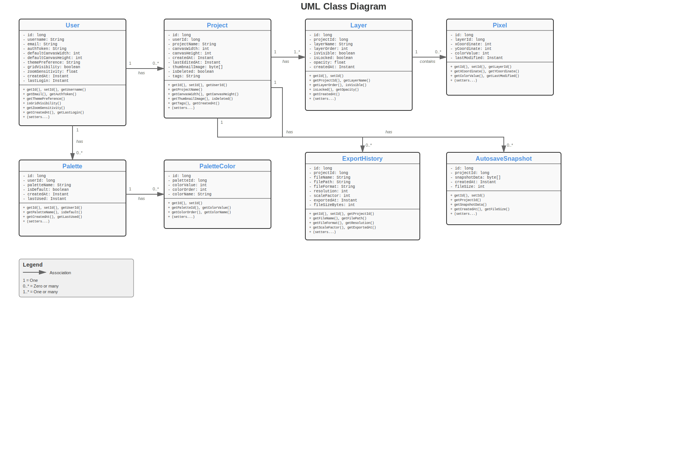

## UML Class Diagram

[//]: # (```mermaid)

[//]: # (classDiagram)

[//]: # (    direction LR)

[//]: # ()
[//]: # (    class User {)

[//]: # (        -long id)

[//]: # (        -String username)

[//]: # (        -String email)

[//]: # (        -String authToken)

[//]: # (        -int defaultCanvasWidth)

[//]: # (        -int defaultCanvasHeight)

[//]: # (        -String themePreference)

[//]: # (        -boolean gridVisibility)

[//]: # (        -float zoomSensitivity)

[//]: # (        -Instant createdAt)

[//]: # (        -Instant lastLogin)

[//]: # (        +long getId&#40;&#41;)

[//]: # (        +void setId&#40;long id&#41;)

[//]: # (        +String getUsername&#40;&#41;)

[//]: # (        +void setUsername&#40;String username&#41;)

[//]: # (        +String getEmail&#40;&#41;)

[//]: # (        +void setEmail&#40;String email&#41;)

[//]: # (        +String getAuthToken&#40;&#41;)

[//]: # (        +void setAuthToken&#40;String authToken&#41;)

[//]: # (        +int getDefaultCanvasWidth&#40;&#41;)

[//]: # (        +void setDefaultCanvasWidth&#40;int defaultCanvasWidth&#41;)

[//]: # (        +int getDefaultCanvasHeight&#40;&#41;)

[//]: # (        +void setDefaultCanvasHeight&#40;int defaultCanvasHeight&#41;)

[//]: # (        +String getThemePreference&#40;&#41;)

[//]: # (        +void setThemePreference&#40;String themePreference&#41;)

[//]: # (        +boolean isGridVisibility&#40;&#41;)

[//]: # (        +void setGridVisibility&#40;boolean gridVisibility&#41;)

[//]: # (        +float getZoomSensitivity&#40;&#41;)

[//]: # (        +void setZoomSensitivity&#40;float zoomSensitivity&#41;)

[//]: # (        +Instant getCreatedAt&#40;&#41;)

[//]: # (        +void setCreatedAt&#40;Instant createdAt&#41;)

[//]: # (        +Instant getLastLogin&#40;&#41;)

[//]: # (        +void setLastLogin&#40;Instant lastLogin&#41;)

[//]: # (    })

[//]: # ()
[//]: # (    class Project {)

[//]: # (        -long id)

[//]: # (        -long userId)

[//]: # (        -String projectName)

[//]: # (        -int canvasWidth)

[//]: # (        -int canvasHeight)

[//]: # (        -Instant createdAt)

[//]: # (        -Instant lastEditedAt)

[//]: # (        -byte[] thumbnailImage)

[//]: # (        -boolean isDeleted)

[//]: # (        -String tags)

[//]: # (        +long getId&#40;&#41;)

[//]: # (        +void setId&#40;long id&#41;)

[//]: # (        +long getUserId&#40;&#41;)

[//]: # (        +void setUserId&#40;long userId&#41;)

[//]: # (        +String getProjectName&#40;&#41;)

[//]: # (        +void setProjectName&#40;String projectName&#41;)

[//]: # (        +int getCanvasWidth&#40;&#41;)

[//]: # (        +void setCanvasWidth&#40;int canvasWidth&#41;)

[//]: # (        +int getCanvasHeight&#40;&#41;)

[//]: # (        +void setCanvasHeight&#40;int canvasHeight&#41;)

[//]: # (        +Instant getCreatedAt&#40;&#41;)

[//]: # (        +void setCreatedAt&#40;Instant createdAt&#41;)

[//]: # (        +Instant getLastEditedAt&#40;&#41;)

[//]: # (        +void setLastEditedAt&#40;Instant lastEditedAt&#41;)

[//]: # (        +byte[] getThumbnailImage&#40;&#41;)

[//]: # (        +void setThumbnailImage&#40;byte[] thumbnailImage&#41;)

[//]: # (        +boolean isDeleted&#40;&#41;)

[//]: # (        +void setDeleted&#40;boolean deleted&#41;)

[//]: # (        +String getTags&#40;&#41;)

[//]: # (        +void setTags&#40;String tags&#41;)

[//]: # (    })

[//]: # ()
[//]: # (    class Layer {)

[//]: # (        -long id)

[//]: # (        -long projectId)

[//]: # (        -String layerName)

[//]: # (        -int layerOrder)

[//]: # (        -boolean isVisible)

[//]: # (        -boolean isLocked)

[//]: # (        -float opacity)

[//]: # (        -Instant createdAt)

[//]: # (        +long getId&#40;&#41;)

[//]: # (        +void setId&#40;long id&#41;)

[//]: # (        +long getProjectId&#40;&#41;)

[//]: # (        +void setProjectId&#40;long projectId&#41;)

[//]: # (        +String getLayerName&#40;&#41;)

[//]: # (        +void setLayerName&#40;String layerName&#41;)

[//]: # (        +int getLayerOrder&#40;&#41;)

[//]: # (        +void setLayerOrder&#40;int layerOrder&#41;)

[//]: # (        +boolean isVisible&#40;&#41;)

[//]: # (        +void setVisible&#40;boolean visible&#41;)

[//]: # (        +boolean isLocked&#40;&#41;)

[//]: # (        +void setLocked&#40;boolean locked&#41;)

[//]: # (        +float getOpacity&#40;&#41;)

[//]: # (        +void setOpacity&#40;float opacity&#41;)

[//]: # (        +Instant getCreatedAt&#40;&#41;)

[//]: # (        +void setCreatedAt&#40;Instant createdAt&#41;)

[//]: # (    })

[//]: # ()
[//]: # (    class Pixel {)

[//]: # (        -long id)

[//]: # (        -long layerId)

[//]: # (        -int xCoordinate)

[//]: # (        -int yCoordinate)

[//]: # (        -int colorValue)

[//]: # (        -Instant lastModified)

[//]: # (        +long getId&#40;&#41;)

[//]: # (        +void setId&#40;long id&#41;)

[//]: # (        +long getLayerId&#40;&#41;)

[//]: # (        +void setLayerId&#40;long layerId&#41;)

[//]: # (        +int getXCoordinate&#40;&#41;)

[//]: # (        +void setXCoordinate&#40;int xCoordinate&#41;)

[//]: # (        +int getYCoordinate&#40;&#41;)

[//]: # (        +void setYCoordinate&#40;int yCoordinate&#41;)

[//]: # (        +int getColorValue&#40;&#41;)

[//]: # (        +void setColorValue&#40;int colorValue&#41;)

[//]: # (        +Instant getLastModified&#40;&#41;)

[//]: # (        +void setLastModified&#40;Instant lastModified&#41;)

[//]: # (    })

[//]: # ()
[//]: # (    class Palette {)

[//]: # (        -long id)

[//]: # (        -long userId)

[//]: # (        -String paletteName)

[//]: # (        -boolean isDefault)

[//]: # (        -Instant createdAt)

[//]: # (        -Instant lastUsed)

[//]: # (        +long getId&#40;&#41;)

[//]: # (        +void setId&#40;long id&#41;)

[//]: # (        +long getUserId&#40;&#41;)

[//]: # (        +void setUserId&#40;long userId&#41;)

[//]: # (        +String getPaletteName&#40;&#41;)

[//]: # (        +void setPaletteName&#40;String paletteName&#41;)

[//]: # (        +boolean isDefault&#40;&#41;)

[//]: # (        +void setDefault&#40;boolean isDefault&#41;)

[//]: # (        +Instant getCreatedAt&#40;&#41;)

[//]: # (        +void setCreatedAt&#40;Instant createdAt&#41;)

[//]: # (        +Instant getLastUsed&#40;&#41;)

[//]: # (        +void setLastUsed&#40;Instant lastUsed&#41;)

[//]: # (    })

[//]: # ()
[//]: # (    class PaletteColor {)

[//]: # (        -long id)

[//]: # (        -long paletteId)

[//]: # (        -int colorValue)

[//]: # (        -int colorOrder)

[//]: # (        -String colorName)

[//]: # (        +long getId&#40;&#41;)

[//]: # (        +void setId&#40;long id&#41;)

[//]: # (        +long getPaletteId&#40;&#41;)

[//]: # (        +void setPaletteId&#40;long paletteId&#41;)

[//]: # (        +int getColorValue&#40;&#41;)

[//]: # (        +void setColorValue&#40;int colorValue&#41;)

[//]: # (        +int getColorOrder&#40;&#41;)

[//]: # (        +void setColorOrder&#40;int colorOrder&#41;)

[//]: # (        +String getColorName&#40;&#41;)

[//]: # (        +void setColorName&#40;String colorName&#41;)

[//]: # (    })

[//]: # ()
[//]: # (    class ExportHistory {)

[//]: # (        -long id)

[//]: # (        -long projectId)

[//]: # (        -String fileName)

[//]: # (        -String filePath)

[//]: # (        -String fileFormat)

[//]: # (        -int resolution)

[//]: # (        -int scaleFactor)

[//]: # (        -Instant exportedAt)

[//]: # (        -int fileSizeBytes)

[//]: # (        +long getId&#40;&#41;)

[//]: # (        +void setId&#40;long id&#41;)

[//]: # (        +long getProjectId&#40;&#41;)

[//]: # (        +void setProjectId&#40;long projectId&#41;)

[//]: # (        +String getFileName&#40;&#41;)

[//]: # (        +void setFileName&#40;String fileName&#41;)

[//]: # (        +String getFilePath&#40;&#41;)

[//]: # (        +void setFilePath&#40;String filePath&#41;)

[//]: # (        +String getFileFormat&#40;&#41;)

[//]: # (        +void setFileFormat&#40;String fileFormat&#41;)

[//]: # (        +int getResolution&#40;&#41;)

[//]: # (        +void setResolution&#40;int resolution&#41;)

[//]: # (        +int getScaleFactor&#40;&#41;)

[//]: # (        +void setScaleFactor&#40;int scaleFactor&#41;)

[//]: # (        +Instant getExportedAt&#40;&#41;)

[//]: # (        +void setExportedAt&#40;Instant exportedAt&#41;)

[//]: # (        +int getFileSizeBytes&#40;&#41;)

[//]: # (        +void setFileSizeBytes&#40;int fileSizeBytes&#41;)

[//]: # (    })

[//]: # ()
[//]: # (    class AutosaveSnapshot {)

[//]: # (        -long id)

[//]: # (        -long projectId)

[//]: # (        -byte[] snapshotData)

[//]: # (        -Instant createdAt)

[//]: # (        -int fileSize)

[//]: # (        +long getId&#40;&#41;)

[//]: # (        +void setId&#40;long id&#41;)

[//]: # (        +long getProjectId&#40;&#41;)

[//]: # (        +void setProjectId&#40;long projectId&#41;)

[//]: # (        +byte[] getSnapshotData&#40;&#41;)

[//]: # (        +void setSnapshotData&#40;byte[] snapshotData&#41;)

[//]: # (        +Instant getCreatedAt&#40;&#41;)

[//]: # (        +void setCreatedAt&#40;Instant createdAt&#41;)

[//]: # (        +int getFileSize&#40;&#41;)

[//]: # (        +void setFileSize&#40;int fileSize&#41;)

[//]: # (    })

[//]: # ()
[//]: # (    User "1" --> "0..*" Project : has)

[//]: # (    User "1" --> "0..*" Palette : has)

[//]: # (    Project "1" --> "1..*" Layer : has)

[//]: # (    Project "1" --> "0..*" ExportHistory : has)

[//]: # (    Project "1" --> "0..*" AutosaveSnapshot : has)

[//]: # (    Layer "1" --> "0..*" Pixel : contains)

[//]: # (    Palette "1" --> "0..*" PaletteColor : has)

[//]: # (```)

[](pdf/uml-class-diagram.pdf)